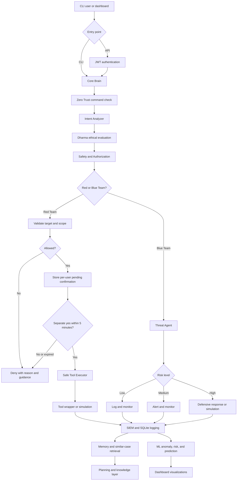

# 🛡️ Vrindha AI SOC

Vrindha is an ethical, defensive-first cybersecurity assistant with a CLI, FastAPI backend, browser dashboard, security-tool wrappers, SIEM-style logging, and lightweight ML analysis. Its policy layer uses intent analysis, authorization checks, and Bhagavad Gita-inspired guidance to keep active security operations controlled.

> **Core policy:** Red Team operations always require a separate confirmation. Blue Team responses may be automated for high-risk events. Use Vrindha only on systems you own or are explicitly authorized to test.

## Features

- **Central orchestrator:** classifies commands and routes them to security agents.
- **Red Team controls:** private/loopback targets by default, per-user confirmation, five-minute confirmation expiry, and no API auto-confirm bypass.
- **Blue Team workflows:** threat analysis, alerts, firewall simulation, IDS monitoring, endpoint checks, and response orchestration.
- **Tool wrappers:** nmap, whois, nikto, gobuster, dirb, amass, sublist3r, tcpdump, hashcat assistant, and related tools.
- **Authentication:** bcrypt-only password hashes, secure first-user bootstrap, and signed, expiring JWT access tokens via a Swagger-visible `BearerAuth` scheme.
- **Dashboard:** command center, logs, status, Gita guidance, tool checks, and Chart.js visualizations.
- **Logging and memory:** SQLite WAL storage, file logs, event correlation, and similar-case retrieval.
- **ML layer:** anomaly detection, rule-based risk scoring, threat prediction, and CSV data export.
- **Safety:** Dharma evaluation, intent detection, Zero Trust scoring, restricted public targets, command timeouts, and simulation fallbacks.

## How Vrindha works



### Request lifecycle

1. A command enters through the local CLI or authenticated API.
2. The Brain applies Zero Trust, intent, Dharma, safety, and target-authorization checks.
3. Red Team commands are restricted to authorized targets and saved as a pending operation. They execute only after a separate confirmation from the same user within five minutes.
4. Blue Team commands are analyzed by risk level. High-risk events can trigger safe defensive responses; operations that do not change the host are explicitly labeled as simulations.
5. Results flow into file/SQLite logging, memory, planning, ML analysis, and dashboard views.

## Detailed component map

```text
Vrindha AI SOC System
│
├── 🧠 Core Brain — core/brain.py
│   ├── Intent Analyzer — safe, suspicious, and malicious intent detection
│   ├── Dharma Engine — ethical allow, deny, or warn evaluation
│   ├── Gita Engine — local verse dataset, search, random verse, guidance
│   ├── Safety Layer — combines intent, Dharma, and authorization
│   ├── Authorization Layer — private/loopback policy and passive WHOIS rules
│   ├── Tool Executor — shell=False subprocess execution and 10-second timeout
│   ├── Zero Trust Engine — command trust score and challenge/deny decisions
│   ├── IAM Module — authentication-pattern and brute-force analysis
│   ├── Memory System — SQLite memory and similar-case retrieval
│   ├── Planning Engine — task decomposition and simulated outcomes
│   └── Knowledge Base — local vulnerabilities, attack patterns, and defenses
│
├── 🔴 Red Team Module — agents/
│   ├── Recon Agent — nmap and network reconnaissance routing
│   ├── Vulnerability Agent — nikto-based vulnerability checks
│   ├── Exploit Assistant — guidance only; no automatic exploitation
│   ├── Network Recon — host and network discovery support
│   └── Tool guidance — whois, amass, sublist3r, gobuster, dirb, tcpdump,
│       hashcat assistant, and Wireshark/tshark
│
├── 🔵 Blue Team Module — agents/ + automation/
│   ├── Threat Agent — LOW, MEDIUM, and HIGH threat classification
│   ├── Response Engine — high-risk defensive response orchestration
│   ├── Actions — validated IP block simulation, process safety, and alerts
│   ├── Firewall Module — failed-login threshold and firewall response checks
│   ├── IDS Monitor — Snort/Suricata monitoring and alerts
│   ├── Rootkit Scanner — rkhunter/chkrootkit checks
│   └── Endpoint Security — rootkit and malware-tool integration
│
├── 🛠️ Tool Layer — tools/
│   ├── nmap_tool.py — service/version scan wrapper
│   ├── whois_tool.py — passive WHOIS lookup
│   ├── nikto_tool.py — web vulnerability scan wrapper
│   ├── amass_tool.py / sublist3r_tool.py — subdomain enumeration
│   ├── gobuster_tool.py / dirb_tool.py — web-content discovery
│   ├── tcpdump_tool.py — capture limited to 50 packets
│   ├── hashcat_tool.py — controlled assistant and command guidance
│   ├── wireshark_tool.py / snort_tool.py — traffic and IDS wrappers
│   ├── network_tool.py — local network-status helpers
│   └── installer.py / verifier.py — availability checks and install guidance
│
├── 📊 SIEM and Logging — agents/siem_agent.py + database/db.py
│   ├── File log — logs/log.txt
│   ├── SQLite — database/vrindha.db in WAL mode
│   ├── Tables — logs, threats, and blocked_ips
│   ├── Queries — recent logs and risk-filtered logs
│   └── Correlation — timeline, correlated threats, and alerts
│
├── 🕉️ Dharma and Guidance — core/
│   ├── gita_engine.py — verse lookup, search, random selection, guidance
│   ├── dharma_engine.py — ethical decision, reason, risk, and guidance
│   └── intent_analyzer.py — harmful and authorized-context detection
│
├── 🤖 Intelligence Layer — core/
│   ├── memory_system.py — FAISS-ready SQLite memory
│   ├── planning_engine.py — ordered defensive task plans
│   ├── knowledge_base.py — local security knowledge
│   └── Brain collaboration — observe, analyze, store, and reuse outcomes
│
├── 📈 ML Layer — ml/
│   ├── data_pipeline.py — log collection, cleaning, JSON, and CSV export
│   ├── anomaly_detector.py — IsolationForest plus rule-based fallback
│   ├── risk_scoring.py — explainable 0–100 event risk score
│   ├── prediction_model.py — heuristic historical-log predictions
│   └── visualization.py — attack, port, and risk dashboard datasets
│
├── 🌐 API Layer — api/
│   ├── main.py — FastAPI routes, request limits, security headers, CORS
│   ├── auth.py — bcrypt, secure user registration, expiring JWTs
│   ├── Public routes — /, /status, /login, /gita/*, /dashboard/, and
│   │   /register while the user store is empty (first-user bootstrap)
│   ├── Protected routes — /command, /logs, /dashboard-data, /ml/*,
│   │   and /tools/verify
│   └── routes.py — application re-export for modular integration
│
├── 🖥️ Dashboard — dashboard/
│   ├── index.html — register, login, command center, status, logs, ML,
│   │   and guidance
│   ├── style.css — responsive dark SOC interface
│   └── app.js — authenticated API requests and Chart.js visualizations
│
├── 🧪 Tests — tests/
│   ├── test_security.py — auth, target policy, harmful intent, IP validation,
│   │   confirmation isolation, auto-confirm prevention, and expiry
│   └── test_registration.py — registration, bootstrap, roles, Bearer auth,
│       OpenAPI security schemes, and user-store behavior
│
└── 🚀 Deployment
    ├── Dockerfile — unprivileged Kali-based API container
    ├── requirements.txt — bounded Python dependency ranges
    ├── .env.example — secrets, admin provisioning, CORS, and safety policy
    └── run.sh — local CLI/API launcher
```

## Requirements

- Python 3.11 recommended
- Linux recommended; Kali Linux provides the fullest tool coverage
- Docker is optional
- External security tools are optional for development; missing tools return clear simulation or installation information

## Installation

```bash
git clone <repository-url>
cd vrindha
python3 -m venv .venv
source .venv/bin/activate
pip install --upgrade pip
pip install -r requirements.txt
```

## Configuration

Create the local environment file:

```bash
cp .env.example .env
```

At minimum, replace these values:

```dotenv
SECRET_KEY=<a-random-secret-of-at-least-32-characters>
ADMIN_USERNAME=admin
ADMIN_PASSWORD=<a-unique-password-of-at-least-12-characters>
```

Generate a suitable secret with:

```bash
python3 -c 'import secrets; print(secrets.token_urlsafe(48))'
```

The administrator is provisioned from the environment when it does not already exist. There are **no default credentials**. Keep `.env` private; it is excluded from Git.

Other important settings:

| Variable | Default | Purpose |
|---|---:|---|
| `ACCESS_TOKEN_EXPIRE_MINUTES` | `60` | JWT lifetime |
| `CORS_ORIGINS` | empty | Comma-separated allowed browser origins; empty means same-origin only |
| `ALLOW_PUBLIC_TARGETS` | `False` | Enables active operations against public targets; keep disabled unless tightly controlled |
| `DEBUG` | `False` | Includes technical error details when enabled; never enable publicly |
| `API_HOST` / `API_PORT` | `0.0.0.0` / `8000` | API bind address and port |

## Running Vrindha

### CLI

```bash
source .venv/bin/activate
python3 main.py
```

Example:

```text
Vrindha> status
Vrindha> scan network 127.0.0.1
Vrindha> yes
Vrindha> detect threats malware attack from 192.168.1.50
Vrindha> show logs
Vrindha> exit
```

The CLI treats the local interactive operator as trusted, but Red Team commands still require a separate `yes` confirmation.

### API and dashboard

```bash
source .venv/bin/activate
uvicorn api.main:app --host 0.0.0.0 --port 8000
```

Open:

- Dashboard: <http://localhost:8000/dashboard/>
- API documentation: <http://localhost:8000/docs>
- Health/status: <http://localhost:8000/status>

Two ways to get an administrator:

- **First-user registration:** while `database/users.json` is empty, `POST /register` is public and creates the first account (always the `admin` role) and returns a Bearer JWT so the operator is logged in immediately.
- **Environment provisioning:** `ADMIN_USERNAME` + `ADMIN_PASSWORD` in `.env` provision an administrator when the API starts.

Log in through the dashboard or with the API using the created account.

### User registration and authentication

#### First-user bootstrap (public, creates the administrator)

While no users exist, anyone may register. The first account is forced to the
`admin` role and the response includes a signed Bearer access token:

```bash
curl -X POST http://127.0.0.1:8000/register \
  -H "Content-Type: application/json" \
  -d '{
    "username": "admin",
    "password": "your-secure-password"
  }'
```

Example response:

```json
{
  "status": "success",
  "message": "First administrator registered",
  "user": {
    "username": "admin",
    "role": "admin",
    "active": true,
    "created": "2026-01-01T00:00:00+00:00"
  },
  "access_token": "SIGNED_JWT",
  "token_type": "bearer"
}
```

The first-registration `access_token` is a real JWT: store it and send it as
`Authorization: Bearer <token>` to authenticated endpoints, exactly like the
token returned by `/login`.

#### Closing public registration

As soon as the first account exists, public registration closes. Any
unauthenticated `POST /register` then returns `401`. To create more users, the
administrator sends their Bearer token:

```bash
curl -X POST http://127.0.0.1:8000/register \
  -H "Authorization: Bearer ADMIN_ACCESS_TOKEN" \
  -H "Content-Type: application/json" \
  -d '{
    "username": "analyst1",
    "password": "another-secure-password",
    "role": "user"
  }'
```

Rules:

- Only an authenticated administrator can create users (`200`/`201` for success).
- A regular (non-admin) user receives `403`.
- Missing or invalid authentication receives `401`.
- Duplicate usernames (case-insensitive) receive `409`.
- Invalid usernames, weak passwords, or unknown roles receive `422`.
- Supported roles are `admin` and `user`.
- Responses never contain a password or password hash.

#### Username and password rules

- Usernames are normalized to lowercase.
- 3–64 characters; must start with a letter or number.
- Only letters, numbers, `.`, `_`, and `-` are allowed.
- Passwords must be at least 12 characters.
- Passwords are hashed with bcrypt only.

#### Using the Bearer token

```bash
TOKEN=$(curl -sS -X POST http://localhost:8000/login \
  -H 'Content-Type: application/json' \
  -d '{"username":"admin","password":"YOUR_PASSWORD"}' \
  | python3 -c 'import json,sys; print(json.load(sys.stdin)["access_token"])')

curl -sS http://localhost:8000/logs \
  -H "Authorization: Bearer $TOKEN"
```

Protected endpoints return `401` with a `WWW-Authenticate: Bearer` header when
the token is missing, invalid, or expired, or when the account was disabled.

#### Swagger Authorize control

Open <http://localhost:8000/docs>. The OpenAPI schema declares an HTTP Bearer
security scheme named **`BearerAuth`** (`components.securitySchemes.BearerAuth`),
so Swagger UI shows an **Authorize** button. Paste the JWT from `/login` or
first-user `/register` into the value field (the `Bearer` prefix is optional in
Swagger UI), authorize, and the "Try it out" calls to protected endpoints will
send the token automatically.

#### Dashboard registration behavior

The dashboard command center has Username, Password, **Register**, **Login**,
and **Logout** controls plus an authentication status message:

- If no users exist, **Register** creates the first administrator, stores the
  returned JWT in `sessionStorage`, and treats you as logged in.
- If an administrator is already logged in, **Register** creates a regular
  user using the current Bearer token.
- The password input is cleared after registration, and success/error messages
  are shown in the status area.

### Authenticated API example

```bash
TOKEN=$(curl -sS -X POST http://localhost:8000/login \
  -H 'Content-Type: application/json' \
  -d '{"username":"admin","password":"YOUR_CONFIGURED_PASSWORD"}' \
  | python3 -c 'import json,sys; print(json.load(sys.stdin)["access_token"])')

curl -sS -X POST http://localhost:8000/command \
  -H "Authorization: Bearer $TOKEN" \
  -H 'Content-Type: application/json' \
  -d '{"command":"status"}'
```

A controlled scan requires two requests:

```bash
curl -sS -X POST http://localhost:8000/command \
  -H "Authorization: Bearer $TOKEN" \
  -H 'Content-Type: application/json' \
  -d '{"command":"scan network 127.0.0.1"}'

curl -sS -X POST http://localhost:8000/command \
  -H "Authorization: Bearer $TOKEN" \
  -H 'Content-Type: application/json' \
  -d '{"command":"yes"}'
```

Confirmations are isolated by authenticated username and expire after five minutes. The legacy `auto_confirm` field is rejected by the API.

## API endpoints

| Endpoint | Method | Authentication | Description |
|---|---|---|---|
| `/` | GET | Public | Basic service information |
| `/status` | GET | Public | Minimal status and container health check |
| `/register` | POST | Public while empty / Admin JWT after | Create the first administrator or, after bootstrap, a user (admin only) |
| `/login` | POST | Public | Exchange credentials for a JWT |
| `/gita/random` | GET | Public | Return a random guidance verse |
| `/gita/verse/{chapter}/{verse}` | GET | Public | Return a specific verse |
| `/command` | POST | Bearer JWT | Process a command |
| `/logs` | GET | Bearer JWT | Return recent logs; `limit` must be 1–500 |
| `/dashboard-data` | GET | Bearer JWT | Return dashboard status and visualization data |
| `/ml/anomaly` | POST | Bearer JWT | Analyze an event for anomalies |
| `/ml/risk` | POST | Bearer JWT | Calculate an event risk score |
| `/ml/predict` | GET | Bearer JWT | Generate heuristic threat predictions |
| `/ml/pipeline` | GET | Bearer JWT | Clean logs and export training CSV data |
| `/tools/verify` | GET | Bearer JWT | Report installed and missing external tools |
| `/dashboard/` | GET | Public | Serve the dashboard; data actions require login |

## Target authorization policy

By default:

- Loopback and private IP addresses are permitted after confirmation.
- Passive WHOIS lookups for valid public domains are permitted after confirmation.
- Active operations against public IP addresses and domains are denied.
- Government- and bank-related targets are explicitly denied by policy.
- Invalid or missing targets are denied rather than guessed.

`ALLOW_PUBLIC_TARGETS=True` is an operator-level escape hatch, not proof of authorization. Only enable it inside a deployment with documented scope controls and explicit permission from the target owner.

## Simulation versus real execution

Vrindha checks whether each external tool is installed. If a tool is unavailable—or an operation is intentionally implemented in safe mode—the response is marked as `simulated`. A simulation does **not** modify firewall rules, kill processes, or perform a real scan.

Some wrappers can execute installed command-line tools after authorization and confirmation. Commands use `shell=False`, bounded output, and a timeout. Review operating-system permissions and network scope before installing or enabling tools.

## Tests

Run the automated security and regression suite:

```bash
source .venv/bin/activate
python -m unittest discover -s tests -v
python -m compileall -q .
pip check
```

The suite currently covers password hashing, JWT validation, harmful-intent denial, target authorization, firewall IP validation, confirmation isolation, confirmation expiry, auto-confirm prevention, plus user registration: forced-admin first user, JWT on first registration, registration closing after bootstrap, admin-only user creation, `401`/`403`/`409`/`422` responses, username normalization, disabled-account rejection, Bearer auth on protected routes, and the `BearerAuth` OpenAPI scheme.

## Docker

Build the image:

```bash
docker build -t vrindha .
```

Run it with runtime credentials and persistent data:

```bash
docker run --rm -p 8000:8000 \
  --env-file .env \
  -v vrindha-database:/app/database \
  -v vrindha-logs:/app/logs \
  vrindha
```

The container runs as an unprivileged user, does not embed credentials, and does not use Uvicorn development reload. Some network-security tools require additional Linux capabilities; grant only the minimum capability required for a documented defensive use case. Do not run the container as privileged merely to make every tool available.

## Security notes

- Sensitive endpoints require a valid Bearer token.
- Login attempts are rate-limited per process.
- Request bodies are limited to 1 MB when `Content-Length` is supplied.
- Dashboard log output is HTML-escaped to prevent stored XSS.
- Error tracebacks remain server-side unless explicitly enabled with `DEBUG=True`.
- SQLite uses WAL mode and a busy timeout for improved local concurrency.
- Dependency versions use bounded compatibility ranges.
- For multi-worker or multi-instance production, move confirmation state and login throttling to a shared store such as Redis.
- Put the API behind HTTPS and a production reverse proxy before exposing it to a network.

## Current limitations

- Risk scoring and prediction are primarily heuristic; they are not a substitute for a production SIEM or EDR.
- Several defensive actions are simulations by design.
- External Kali tools are not installed by Python dependencies.
- Confirmation state and login throttling are process-local.
- The included knowledge and Gita datasets are local project data; review them for your intended educational or production use.
- Docker behavior depends on the current Kali rolling base and should be validated and pinned in your deployment pipeline.

## Ethical use and disclaimer

Use Vrindha only for defensive work, education, authorized lab exercises, or assessments with explicit written permission. Never use it to access, disrupt, monitor, or test systems outside your approved scope.

This software is provided as an educational and defensive-security project without warranty. Operators are responsible for authorization, legal compliance, tool configuration, data protection, and actions taken through the system.
