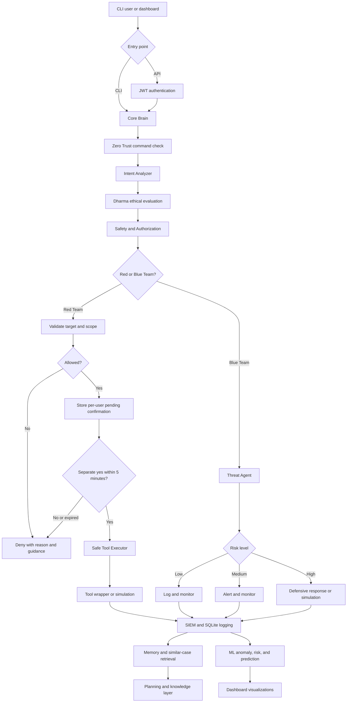

# 🛡️ Vrindha AI SOC

Vrindha is an ethical, defensive-first cybersecurity assistant with a CLI, FastAPI backend, browser dashboard, security-tool wrappers, SIEM-style logging, and lightweight ML analysis. Its policy layer uses intent analysis, authorization checks, and Bhagavad Gita-inspired guidance to keep active security operations controlled.

> **Core policy:** Red Team operations always require a separate confirmation. Blue Team responses may be automated for high-risk events. Use Vrindha only on systems you own or are explicitly authorized to test.

## Features

- **Central orchestrator:** classifies commands and routes them to security agents.
- **Red Team controls:** private/loopback targets by default, per-user confirmation, five-minute confirmation expiry, and no API auto-confirm bypass.
- **Blue Team workflows:** threat analysis, alerts, firewall simulation, IDS monitoring, endpoint checks, and response orchestration.
- **Tool wrappers:** nmap, whois, nikto, gobuster, dirb, amass, sublist3r, tcpdump, hashcat assistant, and related tools.
- **Authentication:** bcrypt-only password hashes, secure first-user/bootstrap, and signed, expiring JWT access tokens via a Swagger-visible `BearerAuth` scheme.
- **Dashboard:** command center, logs, status, Gita guidance, tool checks, and Chart.js visualizations.
- **Logging and memory:** SQLite WAL storage, file logs, event correlation, and similar-case retrieval.
- **ML layer:** anomaly detection, rule-based risk scoring, threat prediction, and CSV data export.
- **Safety:** Dharma evaluation, intent detection, Zero Trust scoring, restricted public targets, command timeouts, and simulation fallbacks.
- **Independent threat intelligence:** sibling `../Vrin_TI/` provides STIX 2.1 IOC storage, CISA KEV/MITRE/TAXII feeds, enrichment, sightings, graph correlation, authenticated SOC↔TI events, Redis/NATS/HTTP transports with SQLite fallback, WebSocket, CLI, dashboard pane, and systemd services without replacing the SOC.

## How Vrindha works



### Request lifecycle

1. A command enters through the local CLI or authenticated API.
2. The Brain applies Zero Trust, intent, Dharma, safety, and target-authorization checks.
3. Red Team commands are restricted to authorized targets and saved as a pending operation. They execute only after a separate confirmation from the same user within five minutes.
4. Blue Team commands are analyzed by risk level. High-risk events can trigger safe defensive responses; operations that do not change the host are explicitly labeled as simulations.
5. Results flow into file/SQLite logging, memory, planning, ML analysis, and dashboard views.

## Detailed component map

```text
Vrindha AI SOC System
│
├── 🧠 Core Brain — core/brain.py
│   ├── Intent Analyzer — safe, suspicious, and malicious intent detection
│   ├── Dharma Engine — ethical allow, deny, or warn evaluation
│   ├── Gita Engine — local verse dataset, search, random verse, guidance
│   ├── Safety Layer — combines intent, Dharma, and authorization
│   ├── Authorization Layer — private/loopback policy and passive WHOIS rules
│   ├── Tool Executor — shell=False subprocess execution and 10-second timeout
│   ├── Zero Trust Engine — command trust score and challenge/deny decisions
│   ├── IAM Module — authentication-pattern and brute-force analysis
│   ├── Memory System — SQLite memory and similar-case retrieval
│   ├── Planning Engine — task decomposition and simulated outcomes
│   └── Knowledge Base — local vulnerabilities, attack patterns, and defenses
│
├── 🔴 Red Team Module — agents/
│   ├── Recon Agent — nmap and network reconnaissance routing
│   ├── Vulnerability Agent — nikto-based vulnerability checks
│   ├── Exploit Assistant — guidance only; no automatic exploitation
│   ├── Network Recon — host and network discovery support
│   └── Tool guidance — whois, amass, sublist3r, gobuster, dirb, tcpdump,
│       hashcat assistant, and Wireshark/tshark
│
├── 🔵 Blue Team Module — agents/ + automation/
│   ├── Threat Agent — LOW, MEDIUM, and HIGH threat classification
│   ├── Response Engine — high-risk defensive response orchestration
│   ├── Actions — validated IP block simulation, process safety, and alerts
│   ├── Firewall Module — failed-login threshold and firewall response checks
│   ├── IDS Monitor — Snort/Suricata monitoring and alerts
│   ├── Rootkit Scanner — rkhunter/chkrootkit checks
│   └── Endpoint Security — rootkit and malware-tool integration
│
├── 🛠️ Tool Layer — tools/
│   ├── nmap_tool.py — service/version scan wrapper
│   ├── whois_tool.py — passive WHOIS lookup
│   ├── nikto_tool.py — web vulnerability scan wrapper
│   ├── amass_tool.py / sublist3r_tool.py — subdomain enumeration
│   ├── gobuster_tool.py / dirb_tool.py — web-content discovery
│   ├── tcpdump_tool.py — capture limited to 50 packets
│   ├── hashcat_tool.py — controlled assistant and command guidance
│   ├── wireshark_tool.py / snort_tool.py — traffic and IDS wrappers
│   ├── network_tool.py — local network-status helpers
│   └── installer.py / verifier.py — availability checks and install guidance
│
├── 📊 SIEM and Logging — agents/siem_agent.py + database/db.py
│   ├── File log — logs/log.txt
│   ├── SQLite — database/vrindha.db in WAL mode
│   ├── Tables — logs, threats, and blocked_ips
│   ├── Queries — recent logs and risk-filtered logs
│   └── Correlation — timeline, correlated threats, and alerts
│
├── 🕉️ Dharma and Guidance — core/
│   ├── gita_engine.py — verse lookup, search, random selection, guidance
│   ├── dharma_engine.py — ethical decision, reason, risk, and guidance
│   └── intent_analyzer.py — harmful and authorized-context detection
│
├── 🤖 Intelligence Layer — core/
│   ├── memory_system.py — FAISS-ready SQLite memory
│   ├── planning_engine.py — ordered defensive task plans
│   ├── knowledge_base.py — local security knowledge
│   └── Brain collaboration — observe, analyze, store, and reuse outcomes
│
├── 📈 ML Layer — ml/
│   ├── data_pipeline.py — log collection, cleaning, JSON, and CSV export
│   ├── anomaly_detector.py — IsolationForest plus rule-based fallback
│   ├── risk_scoring.py — explainable 0–100 event risk score
│   ├── prediction_model.py — heuristic historical-log predictions
│   └── visualization.py — attack, port, and risk dashboard datasets
│
├── 🌐 API Layer — api/
│   ├── main.py — FastAPI routes, request limits, security headers, CORS
│   ├── auth.py — bcrypt, secure user registration, expiring JWTs
│   ├── Public routes — /, /status, /login, /gita/*, /dashboard/, and
│   │   /register while the user store is empty (first-user bootstrap)
│   ├── Protected routes — /command, /logs, /dashboard-data, /ml/*,
│   │   and /tools/verify
│   └── routes.py — application re-export for modular integration
│
├── 🖥️ Dashboard — dashboard/
│   ├── index.html — register, login, command center, status, logs, ML,
│   │   and guidance
│   ├── style.css — responsive dark SOC interface
│   └── app.js — authenticated API requests and Chart.js visualizations
│
├── 🧪 Tests — tests/
│   ├── test_security.py — auth, target policy, harmful intent, IP validation,
│   │   confirmation isolation, auto-confirm prevention, and expiry
│   └── test_registration.py — registration, bootstrap, roles, Bearer auth,
│       OpenAPI security schemes, and user-store behavior
│
└── 🚀 Deployment
    ├── Dockerfile — unprivileged Kali-based API container
    ├── requirements.txt — bounded Python dependency ranges
    ├── .env.example — secrets, admin provisioning, CORS, and safety policy
    └── run.sh — local CLI/API launcher
```

## Requirements

- Python 3.11 recommended
- Linux recommended; Kali Linux provides the fullest tool coverage
- Docker is optional
- External security tools are optional for development; missing tools return clear simulation or installation information

## Installation

```bash
git clone <repository-url>
cd Vrindha_SOC
python3 -m venv .venv
source .venv/bin/activate
pip install --upgrade pip
pip install -r vrin_SOC/requirements.txt -r Vrin_TI/requirements.txt
```

## Configuration

Create the local environment file:

```bash
cp .env.example .env
```

At minimum, replace these values:

```dotenv
SECRET_KEY=<a-random-secret-of-at-least-32-characters>
ADMIN_USERNAME=admin
ADMIN_PASSWORD=<a-unique-password-of-at-least-12-characters>
```

Generate a suitable secret with:

```bash
python3 -c 'import secrets; print(secrets.token_urlsafe(48))'
```

The administrator is provisioned from the environment when it does not already exist. There are **no default credentials**. Keep `.env` private; it is excluded from Git.

Other important settings:

| Variable | Default | Purpose |
|---|---:|---|
| `ACCESS_TOKEN_EXPIRE_MINUTES` | `525600` | JWT lifetime (365 days) |
| `CORS_ORIGINS` | empty | Comma-separated allowed browser origins; empty means same-origin only |
| `ALLOW_PUBLIC_TARGETS` | `False` | Enables active operations against public targets; keep disabled unless tightly controlled |
| `DEBUG` | `False` | Includes technical error details when enabled; never enable publicly |
| `API_HOST` / `API_PORT` | `0.0.0.0` / `8000` | API bind address and port |

## Threat Intelligence dual service

Vrin_TI and the SOC run independently and communicate only through the dedicated gateway:

From the repository root:

```bash
export VRINDHA_TI_API_KEY="$(python3 -c 'import secrets; print(secrets.token_urlsafe(48))')"
.venv/bin/uvicorn Vrin_TI.api:app --host 127.0.0.1 --port 8010
# In another service/process:
.venv/bin/uvicorn vrin_SOC.api.main:app --host 127.0.0.1 --port 8000
./Vrin_TI/vrindha-ti doctor
```

See `../Vrin_TI/docs/threat-intelligence.md`, `../Vrin_TI/docs/soc-ti-integration.md`,
and `../Vrin_TI/docs/threat-intelligence-deployment.md`. The systemd installer is opt-in:
`sudo ./Vrin_TI/scripts/install_threat_intelligence.sh --install-systemd --service-user "$USER"`.

## Running Vrindha

### CLI

```bash
source .venv/bin/activate
python3 -m vrin_SOC
```

Example:

```text
Vrindha> status
Vrindha> scan network 127.0.0.1
Vrindha> yes
Vrindha> detect threats malware attack from 192.168.1.50
Vrindha> show logs
Vrindha> exit
```

The CLI treats the local interactive operator as trusted, but Red Team commands still require a separate `yes` confirmation.

### API and dashboard

```bash
source .venv/bin/activate
python3 -m uvicorn vrin_SOC.api.main:app --host 0.0.0.0 --port 8000
```

Open:

- Dashboard: <http://localhost:8000/dashboard/>
- API documentation: <http://localhost:8000/docs>
- Health/status: <http://localhost:8000/status>

Two ways to get an administrator:

- **First-user registration:** while `database/users.json` is empty, `POST /register` is public and creates the first account (always the `admin` role) and returns a Bearer JWT so the operator is logged in immediately.
- **Environment provisioning:** `ADMIN_USERNAME` + `ADMIN_PASSWORD` in `.env` provision an administrator when the API starts.

Log in through the dashboard or with the API using the created account.
